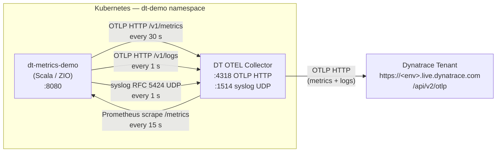

# dt-metrics-demo: Customer Demo Guide

A Scala/ZIO application that demonstrates four distinct observability signal paths into Dynatrace, all routed through a
single [Dynatrace OpenTelemetry Collector](https://github.com/dynatrace/dynatrace-otel-collector).

---

## What this demo exports

The application generates synthetic CPU, memory, and latency values every second and exports them through four
independent paths, each using a different metric/log name prefix so they are easy to distinguish in Dynatrace.

| Signal           | Metric / log names                                                    | Protocol          | Cadence    |
|------------------|-----------------------------------------------------------------------|-------------------|------------|
| **OTEL metrics** | `cn_otel_cpu`, `cn_otel_mem`, `cn_otel_lat`                           | OTLP HTTP         | every 30 s |
| **OTEL logs**    | body contains `cn_otel_log_cpu`, `cn_otel_log_mem`, `cn_otel_log_lat` | OTLP HTTP         | every 1 s  |
| **Syslog**       | body contains `cn_syslog_cpu`, `cn_syslog_mem`, `cn_syslog_lat`       | RFC 5424 UDP      | every 1 s  |
| **Prometheus**   | `cn_prom_app_cpu`, `cn_prom_app_mem`, `cn_prom_app_lat`               | Prometheus scrape | every 15 s |

The application does not talk to Dynatrace directly. All signals flow through the collector.

---

## Architecture



---

## OTEL Collector configuration

The full collector config lives in `k8s/01-otel-collector-cm.yaml`. Here is how each signal is handled.

### OTEL metrics and logs (OTLP receiver)

The app's OTel SDK sends metrics and logs directly to the collector over HTTP.

```yaml
receivers:
  otlp:
    protocols:
      http:
        endpoint: 0.0.0.0:4318
```

- **Metrics** (`cn_otel_*`) are recorded as OTel gauges and flushed every 30 s by the SDK's `PeriodicMetricReader`.
- **Logs** (`cn_otel_log_*`) are emitted by the app's logback `OpenTelemetryAppender`, which bridges ZIO's logging
  layer (via SLF4J) into the OTel SDK's `BatchLogRecordProcessor`.

### Syslog (syslog receiver)

The app sends a raw RFC 5424 UDP datagram every second to the `dt-log-ingest` ClusterIP service, which resolves to the
collector.

```yaml
receivers:
  syslog:
    udp:
      listen_address: "0.0.0.0:1514"
    protocol: rfc5424
```

> **Timestamp format**: the OTel syslog receiver is strict — it requires RFC 3339 with microsecond precision (
`2006-01-02T15:04:05.000000Z`). The app uses `DateTimeFormatter.ofPattern("yyyy-MM-dd'T'HH:mm:ss.SSSSSSX")` to guarantee
> six fractional digits. Java's `Instant.toString()` produces variable precision and will cause parse errors.

### Prometheus (prometheus receiver)

The collector scrapes the app's `/metrics` endpoint on a 15 s interval. No changes are needed in the app — it always
exposes Prometheus-format gauges at that path.

```yaml
receivers:
  prometheus:
    config:
      scrape_configs:
        - job_name: dt-metrics-demo
          scrape_interval: 15s
          static_configs:
            - targets: [ "dt-metrics-demo.dt-demo.svc.cluster.local:8080" ]
```

### Exporter (all pipelines → Dynatrace)

A single OTLP HTTP exporter forwards everything to the Dynatrace ingest endpoint.

```yaml
exporters:
  otlphttp/dynatrace:
    endpoint: "https://<your-env-id>.live.dynatrace.com/api/v2/otlp"
    headers:
      Authorization: "Api-Token ${env:DT_API_TOKEN}"

service:
  pipelines:
    metrics:
      receivers: [ otlp, prometheus ]
      processors: [ batch ]
      exporters: [ otlphttp/dynatrace ]
    logs:
      receivers: [ otlp, syslog ]
      processors: [ batch ]
      exporters: [ otlphttp/dynatrace ]
```

---

## Prerequisites

- [Rancher Desktop](https://rancherdesktop.io/) (or any local Kubernetes — k3s, minikube, kind) with `kubectl`
  configured
- Docker (Rancher Desktop includes it)
- A Dynatrace SaaS tenant
- An API token with the following scopes:

| UI label       | API scope        |
|----------------|------------------|
| Ingest metrics | `metrics.ingest` |
| Ingest logs    | `logs.ingest`    |

---

## Running the demo

### 1. Clone the repository

```bash
git clone <repo-url>
cd dt_metrics_demo
```

### 2. Update the collector endpoint

Edit `k8s/01-otel-collector-cm.yaml` and replace the `endpoint` value with your tenant's OTLP ingest URL:

```yaml
# SaaS
endpoint: "https://<your-env-id>.live.dynatrace.com/api/v2/otlp"

# Managed
endpoint: "https://<your-managed-host>/e/<env-id>/api/v2/otlp"
```

### 3. Build the application image

```bash
docker build -t dt-metrics-demo:latest .
```

The Dockerfile uses a multi-stage build: sbt compiles a fat JAR in the builder stage, which is then copied into a slim
JRE image.

### 4. Create the namespace

```bash
kubectl apply -f k8s/00-namespace.yaml
```

### 5. Create the API token secret

```bash
kubectl create secret generic dt-secrets \
  --from-literal=dt-api-token=<YOUR_API_TOKEN> \
  -n dt-demo
```

### 6. Apply the remaining manifests

```bash
kubectl apply -f k8s/01-otel-collector-cm.yaml
kubectl apply -f k8s/02-otel-collector.yaml
kubectl apply -f k8s/04-app.yaml
```

### 7. Verify everything is running

```bash
kubectl get pods -n dt-demo
```

Expected output — all three pods `Running`:

```
NAME                               READY   STATUS    RESTARTS   AGE
dt-metrics-demo-xxx                1/1     Running   0          1m
otel-collector-xxx                 1/1     Running   0          1m
```

Check the app health endpoint:

```bash
kubectl exec -n dt-demo deploy/dt-metrics-demo -- wget -qO- http://localhost:8080/health/ready
# {"status":"ready"}
```

Check the collector for errors:

```bash
kubectl logs -n dt-demo deploy/otel-collector --tail=20
```

---

## Tearing down

```bash
kubectl delete namespace dt-demo
```

This removes everything — deployments, services, secrets, and config maps.

---

## Querying data in Dynatrace

Open **Notebooks** or the **DQL** query console in your tenant.

**OTEL metrics:**

```
timeseries cpu=avg(cn_otel_cpu), mem=avg(cn_otel_mem), latency=avg(cn_otel_lat)
```

**Prometheus metrics:**

```
timeseries cpu=avg(cn_prom_app_cpu), mem=avg(cn_prom_app_mem), latency=avg(cn_prom_app_lat)
```

**OTEL logs:**

```
fetch logs
| filter matchesPhrase(content, "cn_otel_log")
| fields timestamp, content
| sort timestamp desc
```

**Syslog:**

```
fetch logs
| filter matchesPhrase(content, "cn_syslog_cpu")
| fields timestamp, content
| sort timestamp desc
```

---

## Adapting this demo to your own application

| What to change           | Where                                                                                                           |
|--------------------------|-----------------------------------------------------------------------------------------------------------------|
| Tenant URL               | `k8s/01-otel-collector-cm.yaml` → `exporters.otlphttp/dynatrace.endpoint`                                       |
| Prometheus scrape target | `k8s/01-otel-collector-cm.yaml` → `receivers.prometheus.config.scrape_configs[0].static_configs[0].targets`     |
| Syslog sender address    | Point your app's syslog UDP output at the `dt-log-ingest` ClusterIP service on port 1514                        |
| OTEL SDK endpoint        | Set `OTEL_EXPORTER_OTLP_ENDPOINT=http://otel-collector.dt-demo.svc.cluster.local:4318` in your app's Deployment |
| API token                | `kubectl create secret generic dt-secrets --from-literal=dt-api-token=<token> -n dt-demo`                       |
